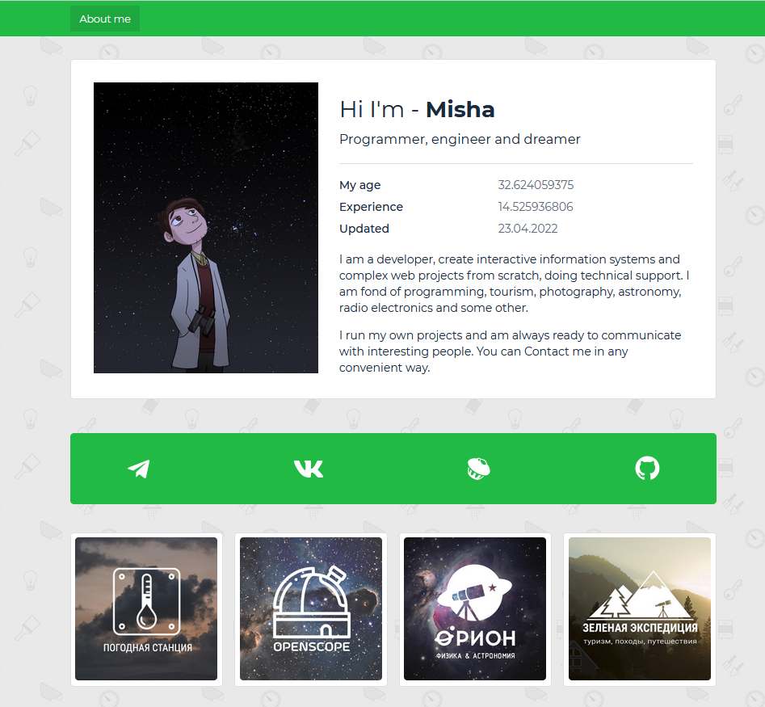

# Personal VCard

[DEMO](https://miksoft.pro)

Hello, this repository contains the source code for my virtual business card. I rewrote it in JS + TS, simplified the use of components, and rethought the architecture of my project based on the experience I have gained lately. Periodically, I will add new features and update the interface. You can use this code as an example or to create your own business card. Thank you!

### NPM available scripts

`npm start`

`npm test`

`npm run build`

`npm run eject`
